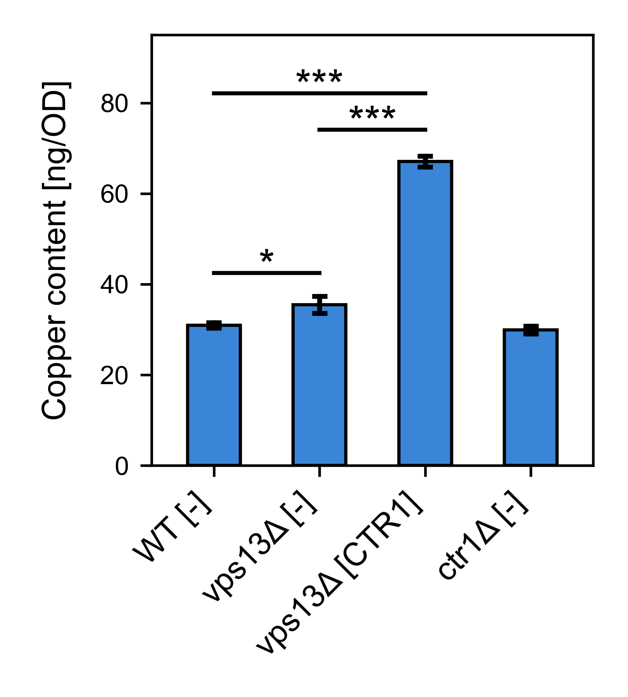

# First real world experience

I this repo I am going to show you an exapmle of my first real world application of Python. I used it for processing and analyzing quantitative data and creating images for my recent research paper (which you can check out here: https://www.mdpi.com/1422-0067/22/5/2248). I applied it in several figures in the article. Here, I inclue a jupyter notebook file in which I quantify copper content in various yeast strains and visualise the data with a barplot with indicated statistical differences. I wanted to play a bit with python statistics packages, therefore I compared usage of scipy and pingouin libriaries.

# Tools used in the project

* Python and libraries: Pandas, Seaborn, Scipy and Pingouin.
* Hypothesis testing

# Results

Here is the chart I include in the paper. 

The chart shows mean copper content in vaious yeast strain. Error bars represent standard deviation. Obtained results
were analysed by ANOVA followed by Tukey’s multiple comparison test (n = 3, * p < 0.05, *** p < 0.001).
